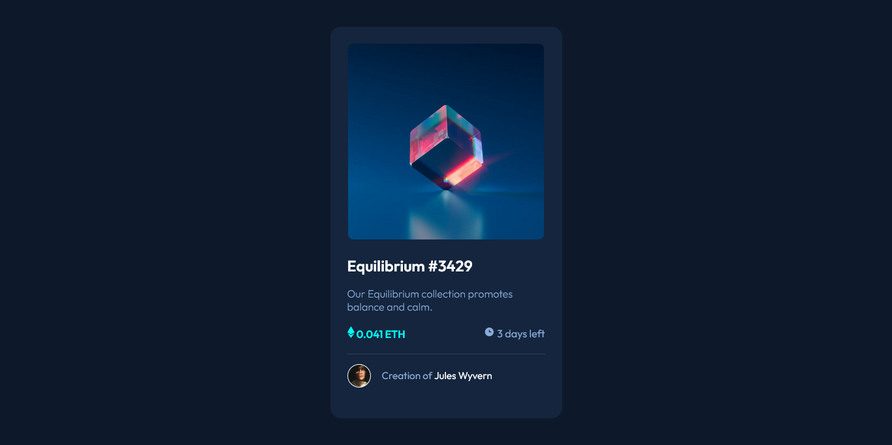
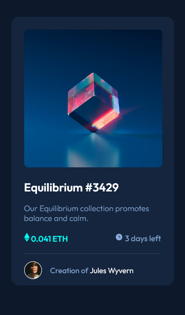

# Frontend Mentor - NFT preview card component solution

This is a solution to the [NFT preview card component challenge on Frontend Mentor](https://www.frontendmentor.io/challenges/nft-preview-card-component-SbdUL_w0U). Frontend Mentor challenges help you improve your coding skills by building realistic projects. 

## Overview

### The challenge

Users should be able to:

- View the optimal layout depending on their device's screen size
- See hover states for interactive elements

### Screenshot

### Links

- Solution URL: [Add solution URL here]https://github.com/lizSilva27/NFT_PreviewCardComponent-FrontendMentor
- Live Site URL: [Add live site URL here] https://your-live-site-url.com](https://ntfcardcomponent.netlify.app

## My process

### Built with

- Semantic HTML5 markup
- CSS custom properties
- Flexbox
- Mobile-first workflow

## Author

- Github - https://github.com/lizSilva27
- Frontend Mentor https://www.frontendmentor.io/profile/lizSilva27
